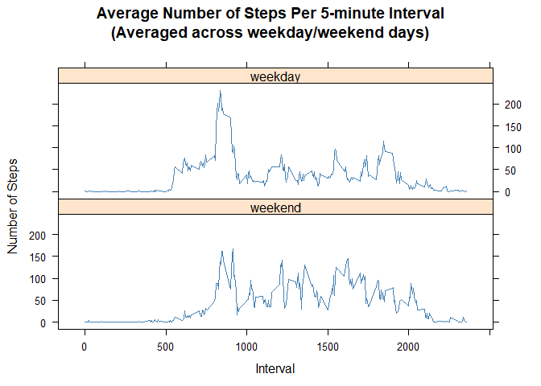

# Introduction
This assignment analyses the data from a personal activity monitoring device used by an anonymous individual. The data consists of 2 months of data collected during the months of October and November, 2012.

The dataset has a total of 17,568 observations and consists of following variables - 

- **steps**: Number of steps taken in a 5-minute interval (missing values are coded as **NA**)
- **date**: The date on which the measurement was taken in YYYY-MM-DD format
- **interval**: Identifier for the 5-minute interval in which measurement was taken


## Loading and preprocessing the data
The data is stored in a comma-separated-value (CSV) file. First, we read the data file and convert date variable to Date format.


```r
activity <- read.csv("activity.csv")
activity$date <- as.Date(activity$date)
```

## What is mean total number of steps taken per day?
The histogram below illustrates the total number of steps taken per day. Missing values are ignored for this plot and associated computation.


```r
library(dplyr)
totalstepsdaily <- activity %>% 
                    group_by(date) %>% 
                    summarise(dailysteps = sum(steps, na.rm = TRUE))

# Compute Mean and Median
meansteps <- mean(totalstepsdaily$dailysteps)
mediansteps <- median(totalstepsdaily$dailysteps)

# Plot Histogram
hist(totalstepsdaily$dailysteps, breaks = 10, labels = TRUE,
     col = "lightblue", border = "red", density = 30, ylim = c(0,25),
     xlab = "Number of Steps", main = "Total Number of Steps Per Day")

# Add a line showing the mean on the plot
abline(v = meansteps, col = "seagreen", lwd = 2)
text(meansteps, 1, "Mean", col = "blue", srt = 90, pos = 4, offset = 0.5)

# Add a line marking the median on the plot
abline(v = mediansteps, col = "violet", lwd = 2)
text(mediansteps, 1, "Median", col = "blue", srt = 90, pos = 4, offset = 0.5)
```

<!-- -->

The total number of steps taken per day can be summarised as -

* **Mean** - 9354 steps  
* **Median** - 10395 steps  

## What is the average daily activity pattern?
The average daily activity pattern is illustrated by the time series plot shown below. For this, the steps taken per 5-minute interval are averaged across all days.


```r
# Compute average no. of steps taken, averaged across all days, per 5-min interval
avgstepsperinterval <-  activity %>% 
                        group_by(interval) %>% 
                        summarise(steps = mean(steps, na.rm = TRUE))

plot(avgstepsperinterval$interval, avgstepsperinterval$steps, 
     type = "l", col = "steelblue", lwd = 2,
     main = "Average Number of Steps Per 5-minute Interval\n(Averaged across all days)",
     xlab = "Interval",
     ylab = "Number of Steps")
```

<!-- -->

```r
# Find 5-min interval with max. number of steps
index <- which.max(avgstepsperinterval$steps)
maxinterval <- avgstepsperinterval[index, "interval"]

# Compute Max number of steps 
maxsteps <- avgstepsperinterval[index, "steps"]
```

The interval number **835** contains the maximum (**206**) number of steps averaged across all days.  

## Imputing missing values


```r
missing <- sum(is.na(activity$steps))
```
There are **2304** number of missing values for some days/intervals. To study the impact of missing values, a new dataset is created by imputing the missing values. Missing values are filled using the average number of steps (averaged across all days) for particular 5-minute interval.


```r
# Create a new dataset from original dataset
activityimputed <- data.frame(activity)

# Impute missing value and store in new dataset
activityimputed[is.na(activity$steps), "steps"] <- with(avgstepsperinterval, 
                                                        steps[match(activity[is.na(activity$steps), 
                                                                             "interval"], interval)])
# Compute new total no. of steps taken per day 
totalstepsdaily2 <- activityimputed %>% 
                    group_by(date) %>% 
                    summarise(dailysteps = sum(steps, na.rm = TRUE))

# Compute new Mean and Median
meansteps2 <- round(mean(totalstepsdaily2$dailysteps))
mediansteps2 <- round(median(totalstepsdaily2$dailysteps))
```

The histogram below illustrates the total number of steps taken per day with the missing values imputed.


```r
# Histogram of Total #Steps taken per day
hist(totalstepsdaily2$dailysteps, breaks = 10,  labels = TRUE,
     col = "lightblue", border = "red", density = 30, ylim = c(0, 25),
     main = "Total Number of Steps Per Day\n(Imputing missing values)",
     xlab = "Number of Steps")
```

<!-- -->

The total number of steps taken per day can be summarised as -

* **Mean** - 10766 steps  
* **Median** - 10766 steps  

Imputing the missing values has resulted in increase in the mean and median number of steps per day.  
There is not much change in total number of steps taken per day though, except for decrease in the range  **0-2000** and increase in the range **10K-12K**, that is, lesser number of days fall in earlier range and more in latter range now. 

## Are there differences in activity patterns between weekdays and weekends?
The time series plot below illustrates the total number of steps taken per 5-minute interval averaged across all days, categorised by weekday/weekend day. Imputed dataset is used for comparing activity patterns between weekdays and weekends. 


```r
# Create a new factor variable in imputed dataset indicating 
# if a given date is "weekday" or "weekend" day
wdays <- c("Monday", "Tuesday","Wednesday", "Thursday", "Friday")
activityimputed$wday <- factor((weekdays(activity$date) %in% wdays), 
                               levels = c("FALSE", "TRUE"), labels = c("weekend", "weekday"))

# Compute average number of steps per 5-minute interval
avgsteps <-     activityimputed %>% 
                group_by(wday, interval) %>% 
                summarise(steps = mean(steps))

# Panel plot to compare average number of steps between weekdays and weekends
library(lattice)
myplot <- xyplot(steps~interval|wday, data = avgsteps, 
       layout = c(1,2), type = "l", col = "steelblue",
       main = "Average Number of Steps Per 5-minute Interval\n(Averaged across weekday/weekend days)",
       xlab = "Interval",
       ylab = "Number of Steps")
print(myplot)
```

<!-- -->

During **weekdays**, on average, **more** number of steps are taken during intervals **500-1000**, while on **weekends** intervals **1000 and up** have **more** number of steps.
